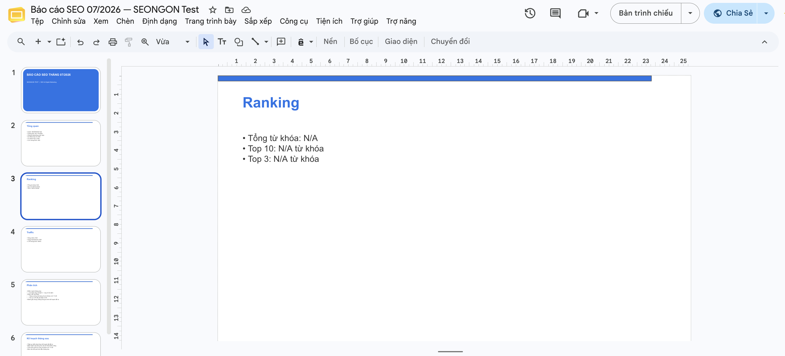
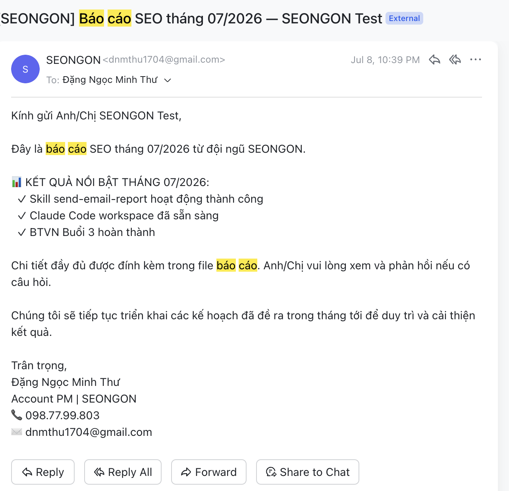

# Claude Code Workspace — Đặng Ngọc Minh Thư

Không gian làm việc cá nhân với Claude Code, xây dựng cho công việc Account PM tại SEONGON — nơi phần lớn thời gian mỗi tháng bị chiếm bởi 2 việc lặp lại: dựng báo cáo SEO gửi client và soạn biên bản/email sau mỗi buổi họp. Workspace này không thay tôi làm toàn bộ, mà đảm nhiệm phần tốn thời gian nhất (dựng khung, tính số liệu, soạn nháp) để tôi chỉ cần tập trung vào phần cần con người: review, tinh chỉnh nội dung, và quyết định gửi.

**Hiệu quả thực tế sau khi áp dụng:**

| Việc | Trước đây | Sau khi có agent | 
|------|-----------|-------------------|
| Làm slide báo cáo SEO tháng | ~2 ngày (tự tổng hợp số liệu, dựng từng slide, chèn bảng/biểu đồ tay) | **~3 tiếng** chỉnh sửa lại nội dung (`report-agent` tự đọc data, dựng slide + bảng + biểu đồ, tôi chỉ review và tinh chỉnh) |
| Soạn & gửi email cho client | ~30 phút mỗi email (tự viết từ đầu, đúng văn phong, không sót thông tin) | **~10 phút** (`send-email-report`/`send-email-meeting` tự soạn nháp đúng văn phong SEONGON, tôi chỉ đọc duyệt rồi xác nhận gửi) |

## Cấu trúc

```
.claude/
  agents/
    report-agent.md          # Chu kỳ báo cáo tháng: monthly-report + send-email-report
    meeting-agent.md         # Chu kỳ sau họp: meeting-notes + send-email-meeting
  skills/
    meeting-notes/           # Format recap họp → Google Docs
    monthly-report/          # Tạo báo cáo SEO tháng → Google Slides
    send-email-report/       # Soạn + gửi email báo cáo tháng qua Gmail
    send-email-meeting/      # Soạn + gửi email biên bản họp qua Gmail
outputs/                    # File output từ việc chạy skills
chat-history/               # Lịch sử trò chuyện với Claude Code
drive_upload.py             # Tiện ích upload file lên Google Drive
```

## Agents

| Agent | Vai trò | Skills sử dụng |
|-------|---------|-----------------|
| `report-agent` | Tạo + gửi báo cáo SEO tháng cho client (end-to-end) | `monthly-report`, `send-email-report` |
| `meeting-agent` | Hệ thống hoá + gửi biên bản họp cho client (end-to-end) | `meeting-notes`, `send-email-meeting` |

Giao 1 nhiệm vụ lớn cho Claude Code (vd: *"Tạo báo cáo SEO tháng 07 cho TMA Solutions và gửi cho client"* hoặc *"Hệ thống hoá recap họp hôm nay và gửi cho khách"*), Claude Code sẽ tự nhận việc thuộc agent nào và chạy đủ 2 skill của agent đó theo thứ tự (tạo nội dung → soạn & gửi email), không cần chỉ định thủ công từng bước.

## SKILLs

| Skill | Mô tả | Kết nối ngoài | Output |
|-------|-------|---------------|--------|
| `/meeting-notes` | Nhận recap thô → hệ thống hoá → Google Docs (2 phần: Nội dung trao đổi + Next steps) | Google Drive API | Google Docs |
| `/monthly-report` | Nhận file data SEO + config dự án → tạo slide báo cáo tháng | Google Slides API | Google Slides |
| `/send-email-report` | Soạn và gửi email báo cáo SEO tháng cho client kèm chữ ký | Gmail SMTP + App Password | Email + .txt draft |
| `/send-email-meeting` | Soạn và gửi email biên bản họp cho client (3 mẫu: chuẩn / ngắn gọn / nhấn mạnh action items) | Gmail SMTP + App Password (dùng chung với send-email-report) | Email + .txt draft |

## Cài đặt

```bash
pip3 install python-docx openpyxl pandas google-api-python-client google-auth-httplib2 google-auth-oauthlib matplotlib
```

## Setup kết nối ngoài

### Gmail (send-email-report)
1. Bật 2-Step Verification tại myaccount.google.com/security
2. Tạo App Password tại myaccount.google.com/apppasswords
3. Thêm vào `.claude/skills/send-email-report/config.json`:
```json
{
  "gmail_user": "your@gmail.com",
  "gmail_app_password": "xxxx xxxx xxxx xxxx",
  "sender_name": "SEONGON"
}
```

### Google Drive & Slides API (meeting-notes, monthly-report)
1. Bật Drive API + Slides API tại console.cloud.google.com
2. Tạo OAuth 2.0 credentials (Desktop app) → download `credentials.json`
3. Đặt `credentials.json` vào thư mục gốc workspace
4. Lần đầu chạy sẽ mở trình duyệt để xác nhận quyền

## Output mẫu

- **Biên bản họp TMA Solutions 03/07/2026**: [Google Docs](https://docs.google.com/document/d/157zEbJeVirtgRkvkG_tB8I3YtPnovB2pnOq0jlvV21Y/edit)
- **Báo cáo SEO 07/2026**: [Google Slides](https://docs.google.com/presentation/d/18djhSeTBOYK4AwLE1WelD5EBRT1UuIpL_LNNBQDhs70/edit)
- **Email gửi thành công**: dangngocminhthu@seongon.com (08/07/2026)

## Slide trình bày

[`docs/2-agent-claude-code-account-pm-seongon.pptx`](docs/2-agent-claude-code-account-pm-seongon.pptx) — giới thiệu 2 agent, cách chúng hoạt động, và minh chứng đã áp dụng vào công việc thật.

## Quá trình vận dụng Claude Code

Workspace này được xây dựng hoàn toàn qua các phiên làm việc trực tiếp với Claude Code, không viết tay từ đầu:

1. **07/07/2026** — Khởi tạo 3 skill đầu tiên (`meeting-notes`, `monthly-report`, và một bản nháp `gsheet-to-report`). Sau khi thử, skill gửi báo cáo qua Google Sheet không sát nhu cầu thực tế (Account PM cần gửi **email** cho client, không phải chia sẻ sheet) → yêu cầu Claude Code đổi hướng, thay bằng `send-email-report` dùng Gmail SMTP + App Password (commit `e4ad5c5`).
2. **07-08/07/2026** — Rebuild lại 3 skill với cấu trúc chuẩn (`SKILL.md` + script Python + `README.md` cho từng skill), thêm kết nối nền tảng ngoài thật (Google Drive/Slides API, Gmail SMTP) thay vì chỉ chạy nội bộ. Toàn bộ phiên làm việc này được export bằng lệnh `/export` của Claude Code và lưu tại [`chat-history/btvn-buoi-3-chat-history.jsonl`](chat-history/btvn-buoi-3-chat-history.jsonl).
3. **09/07/2026** — Nhận ra 4 skill lẻ vẫn cần gọi thủ công từng bước → yêu cầu Claude Code gói lại thành 2 **sub-agent** (`report-agent`, `meeting-agent`), mỗi agent tự nhận diện nhiệm vụ và chạy đủ chuỗi "tạo nội dung → soạn & gửi email" cho một task duy nhất (commit `f0fbb9a`). Cùng phiên đó, sửa lỗi parser của `meeting-notes`/`send-email` và nâng `monthly-report` từ chỉ có bullet point lên có bảng dữ liệu thật + biểu đồ (pie/bar chart) chèn trực tiếp vào Slides (commit `9746781`).

Cách vận dụng xuyên suốt: **giao việc bằng ngôn ngữ tự nhiên, không chỉ định từng bước** (vd: *"Tạo báo cáo SEO tháng 07 cho TMA Solutions và gửi cho client"*) — Claude Code tự đọc `SKILL.md`/agent definition tương ứng, tự chạy script, tự dừng lại xin xác nhận trước khi gửi email thật.

## Demo

Sản phẩm đầu ra thật đã tạo bằng skill: xem mục **Output mẫu** ở trên (link Google Docs/Slides + email đã gửi) và các file trong [`outputs/`](outputs/).

**Ảnh chụp thật:**

Google Slides báo cáo tháng (tạo bằng `monthly-report`, deck test kết nối API — số liệu Ranking hiển thị N/A vì chạy với data giả để test luồng, cấu trúc slide/bảng/chart tạo tự động qua Slides API là thật):



Email báo cáo gửi thành công qua Gmail SMTP (tạo + gửi bằng `send-email-report`):



## Ghi chú bảo mật

`credentials.json`, `token.json`, và `config.json` được gitignore — không bao giờ commit lên GitHub.
